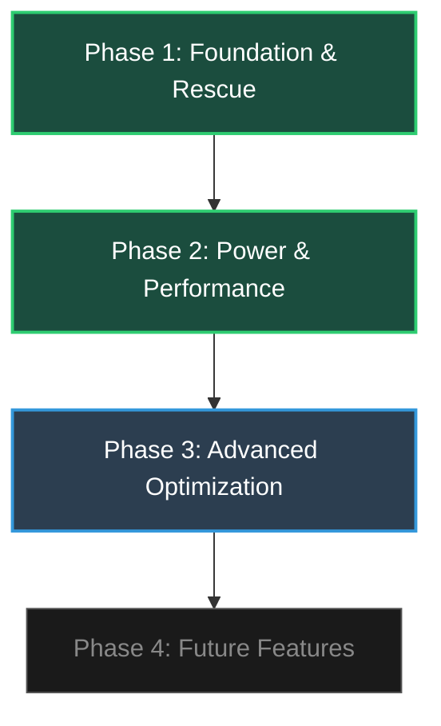

# Epitaph Kernel — Development Roadmap

### Custom GKI Kernel for Redmi 12 (fire) — Android 15 HyperOS 2.0

---

---

## Phase 1: Foundation & Recovery (Completed)

- [x] Unified multi-toolchain CI/CD pipeline (GitHub Actions)
- [x] KernelSU-Next & SUSFS 4 KSU integration
- [x] Xiaomi modular WiFi/Hotspot bypass (vermagic patching)
- [x] RAMoops (PStore) rescue subsystem
- [x] AnyKernel3 flashable ZIP packaging
- [x] Telegram build notification bot

## Phase 2: Power & Performance (Completed)

- [x] ZRAM ZSTD multi-stream compression
- [x] Epitaph Schedutil governor (3 profiles: performance/balanced/battery)
- [x] BFQ + Kyber I/O schedulers
- [x] BBR TCP congestion control + FQ queueing
- [x] MGLRU memory reclamation
- [x] HZ=300 scheduler tuning
- [x] eMMC 5.1 storage I/O latency tweaks
- [x] Epitaph Tuner post-boot script (GPU GED bypass, CPU uclamp)

## Phase 3: Advanced Optimization (Current)

- [ ] ThinLTO binary compression optimization
- [ ] Cortex-A75/A55 targeted compiler flags
- [ ] WireGuard VPN kernel driver
- [ ] Enhanced PStore log parser in Rescue Tool

## Phase 4: Future Features (Planned)

- [ ] LCM panel driver reverse engineering (if needed)
- [ ] Advanced thermal management profiles
- [ ] Custom SELinux policy modules

---

> **Status:** Phases 1-2 fully completed. Currently optimizing build pipeline and binary size in Phase 3.
