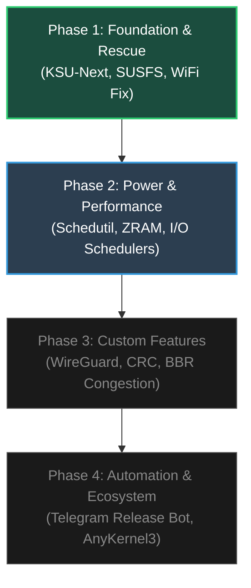

# 🗺️ Epitaph Kernel — Development Roadmap
### **Custom GKI Kernel Project for Redmi 12 (fire) — Android 15 HyperOS 2.0**

This roadmap details the current achievements of the **Epitaph Kernel** project and outlines a strategic, step-by-step path for future custom optimizations, gaming enhancements, and release automation.

---

---

## 🟢 Phase 1: Foundation & Recovery (Completed & Verified)
*Focus: Get KSU-Next and SUSFS running cleanly on Android 15, and guarantee a foolproof brick recovery mechanism.*

- [x] **Unified Multi-Toolchain CI/CD Pipeline:** Fully automated matrix building supporting 5 state-of-the-art toolchains (`Bazel`, `AOSP Clang`, `ZyClang`, `WeebX Clang`, `Neutron Clang`).
- [x] **KernelSU-Next & SUSFS 4 KSU:** Up-to-date kernel-level root and spoofing subsystem integration.
- [x] **Xiaomi Modular WiFi/Hotspot Bypass:** Custom `patch_vermagic.py` implementation that dynamically bypasses version-magic mismatches, allowing closed-source Xiaomi stock drivers (`wlan.ko`) to load effortlessly.
- [x] **RAMoops (PStore) Rescue Subsystem:** Dedicated debug boot image build setup with pre-allocated RAM crash consoles (`0x4d010000`) for capturing real-time kernel panic logs without custom recovery.

---

## 🔵 Phase 2: Power & Performance Tweaks (Current / Next Steps)
*Focus: Maximize fluid UI responsiveness, optimize battery standby, and tune memory management for Android 15 HyperOS 2.0.*

### 1. Advanced Memory Management (ZRAM / Swap Optimization)
> Android 15 HyperOS 2.0 can be memory-heavy. Optimizing ZRAM at the kernel level drastically increases multitasking capabilities.
- **Action:** Switch the default ZRAM compression algorithm from `lzo` to **`zstd`** or **`lz4`** inside `arch/arm64/configs/gki_defconfig`.
- **Tweak:** Enable multi-compression streams for ZRAM so that multiple CPU cores can compress/decompress memory pages in parallel.

### 2. CPU Frequency Governor Tuning (`Schedutil` / `Energy Aware Scheduling`)
> The Helio G88 (MT6769) is an octa-core CPU (2x Cortex-A75 @ 2.0GHz, 6x Cortex-A55 @ 1.8GHz). Tuning Schedutil makes governor shifts faster and smoother.
- **Action:** Tune rate limits in the scheduler. Set `up_rate_limit_us` lower (e.g., `500` or `1000`) so the CPU jumps to high frequencies instantly when launching apps, and set a higher `down_rate_limit_us` so frequencies don't drop too aggressively between frame draws.

### 3. High-Performance I/O Schedulers
> Stock GKI kernels only ship with minimal I/O schedulers like `none` or `mq-deadline`. Adding premium schedulers eliminates storage bottlenecks.
- **Action:** Backport and enable **`BFQ (Budget Fair Queueing)`** or **`Kyber`** in the kernel. BFQ is legendary for keeping the system extremely smooth while downloading files or copying data in the background.

---

## 🟣 Phase 3: Premium Custom Features & Gaming
*Focus: Backport high-performance network subsystems, hardware color controls, and security protocols.*

### 1. In-Kernel WireGuard VPN Driver
> Standard VPNs run in user-space, which consumes high CPU and drains battery. Backporting the official WireGuard kernel driver delivers ultra-low ping and near-zero CPU overhead.
- **Action:** Pull the official WireGuard kernel source (`drivers/net/wireguard`) and patch the Kconfig/Makefile.

### 2. MMC Storage CRC Disable Toggle
> Disabling Cyclic Redundancy Check (CRC) for the MMC storage interface can boost random read/write speeds by up to **30%**, speeding up game loading times significantly.
- **Action:** Introduce a custom config or sysfs node to toggle `CONFIG_MMC_SIMULATE_MAX_SPEED` or bypass CRC verification checks for memory blocks.

### 3. BBR TCP Congestion Control
> Replace the aging TCP Cubic with Google's **BBR (Bottleneck Bandwidth and RTT)** congestion control to achieve lower latency, better bandwidth utilization, and less packet loss during mobile gaming.
- **Action:** Enable `CONFIG_TCP_CONG_BBR` in defconfig.

---

## 🟡 Phase 4: Automation & Ecosystem
*Focus: Streamline the deployment pipeline and make installing the kernel a premium experience for end users.*

### 1. AnyKernel3 Interactive Zip Customization
- **Action:** Integrate [AnyKernel3](https://github.com/osm0sis/AnyKernel3) directly into the packaging step of `_build_kernel_core.yml`.
- **Feature:** Automate the script to dynamically patch the stock `boot.img`'s ramdisk during installation, creating a single flashable ZIP package that users can install in seconds once custom recoveries are available.

### 2. Automatic Telegram & GitHub Release Bot
- **Action:** Extend the `summary` job in `build_manager_gki.yml` to automatically upload compiled flashable boot images and changelogs directly to a Telegram channel or release channel, alongside complete build metadata.

---

> [!TIP]
> **Recommended Next Move:** Start with **Phase 2 (ZRAM and Schedutil Tuning)**. It requires no heavy backporting, is extremely safe, and will give your phone a highly noticeable speed and battery boost on Android 15 HyperOS 2.0!
